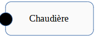
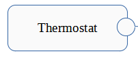
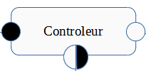
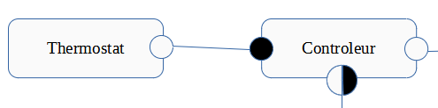
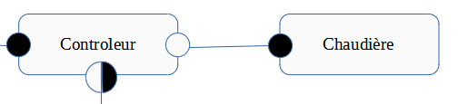
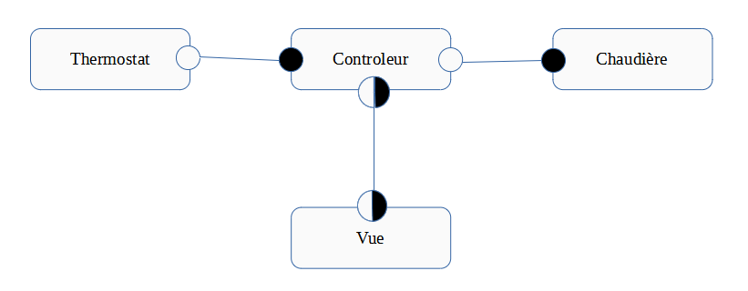
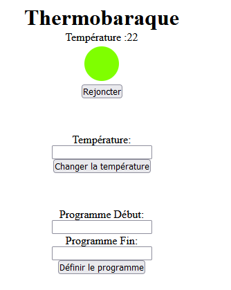
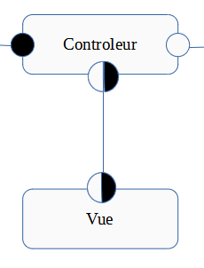

# Architecture Logicielle TP2
### Antoine DEPOISIER & Jules FINCK

Le lien du TP est disponible sur le repo git suivant :
https://github.com/copsfuraxx/INFO801-TP2

## Choix d'architecture

Pour la réalisation de ce TP, nous avons décidé d'utiliser le style architectural de type "composants et connecteurs".

## Les Composants

Notre application comporte 3 composants : 

### La Chaudière

Ce composant n'effectue pas de calcul, il réalise juste le stockage du stockage de données. Il stocke juste si la chaudière est allumée ou éteinte.

Pour permettre aux autres composants de connaitre l'état de la chaudière, une interface a été créée pour accéder à son état.

```js
app.get('/etat/:etat', (req, res) => {
    let etat = req.params.etat
    let op = etat == 'on' ? "Chaudière : Allumage de la chaudière" : "Chaudière : Arret de la chaudière"
    console.log(op)
    if (etat == 'on') res.json({statut:0, isOn:true})
    else if (etat == 'off') res.json({statut:0, isOn:false})
    else res.json({statut:1, isOn:null})
})
```

<p align="center">
  
</p>

### Le Thermostat

Ce composant effectue un calcul, mais il le fait uniquement par soucis de moyen technique. C'est-à-dire que nous n'avons pas un vrai thermostat connecté à requêter, donc nous avons fait en sorte que toutes les 2 secondes où la chaudière est allumée, la température va augmenter d'un degré.

```js
setInterval(run, 2000);

async function run() {
  fetch('http://localhost:3000/temperature', {
    method: 'post',
    body: JSON.stringify(body),
    headers: {'Content-Type': 'application/json'}
  }).then((response) => response.json()).then((json) => {
    if (json.isOn) {
      body.temperature++
    }
    else {
      body.temperature--
    }
  })
}
```

Ce composant sert au stockage de la température ambiante.

Ce composant ne possède pas d'interface, aucun agent externe ne peut le requêter.

<p align="center">
  
</p>

### Le Contrôleur

À chaque fois que le contrôleur reçoit une nouvelle température, il va effectuer différentes actions selon les données stockées en mémoire.

Il y a plusieurs scénarios.

Tout d'abord, si le dernier rapport est un échec et date de moins de 5 minutes, ou bien si le disjoncteur est éteint, il ne va rien faire.

```js
if(!(Date.now() - lastReport < cinqMin || isDisconected))
```

Dans un second temps, si le système est en mode programmé, il va allumer la chaudière si l'ont se trouve dans la plage horaire programmée et si elle est éteinte.

```js
let dateNow = new Date()
dateNow = dateNow.getHours() * 3600000 + dateNow.getMinutes() * 60000
console.log(debutProgramme)
console.log(dateNow)
if(debutProgramme <= dateNow && finProgramme >= dateNow) {
    try {
        fetchWithTimeout('http://localhost:3001/etat/on', {
            method: 'get',
            headers: {'Content-Type': 'application/json'}
        }).then((response) => response.json()).then((json) => {
            if (json.statut == 1) {
                lastReport = Date.now()
                isDisconected = true
                isChaudiereOn = false
                webSocket.forEach((i) => i.send('disj:off'))
            }
            isChaudiereOn = json.isOn
            res.json({isOn:isChaudiereOn})
        }).catch((error) => {
            lastReport = Date.now()
            isDisconected = true
            isChaudiereOn = false
            webSocket.forEach((i) => i.send('disj:off'))
            res.json({isOn:isChaudiereOn})
        })
    } catch (error) {
        lastReport = Date.now()
        isDisconected = true
        isChaudiereOn = false
        webSocket.forEach((i) => i.send('disj:off'))
        res.json({isOn:isChaudiereOn})
    }
}
```

Dans un dernier temps, si la température mesurée est différente de la température référente avec une fourchette de 2° C, il va soit allumer la chaudière ou l'éteindre selon la différence et l'état actuel de la chaudière.

```js
else {
    let etat = (currentTemp > tempR + 2) ? 'off' : (currentTemp < tempR - 2 ? 'on' : null)
    if((etat == 'on') || (etat == 'off' && isChaudiereOn)) {
        console.log("Controleur : Demande à la Chaudière : " + etat)
        try {
            fetchWithTimeout('http://localhost:3001/etat/' + etat, {
                method: 'get',
                headers: {'Content-Type': 'application/json'}
            }).then((response) => response.json()).then((json) => {
                if (json.statut == 1) {
                    lastReport = Date.now()
                    isDisconected = true
                    isChaudiereOn = false
                    webSocket.forEach((i) => i.send('disj:off'))
                } else {
                    isChaudiereOn = json.isOn
                }
                res.json({isOn:isChaudiereOn})
            }).catch((error) => {
                lastReport = Date.now()
                isDisconected = true
                isChaudiereOn = false
                webSocket.forEach((i) => i.send('disj:off'))
                res.json({isOn:isChaudiereOn})
            })
        } catch (error) {
            lastReport = Date.now()
            isDisconected = true
            isChaudiereOn = false
            webSocket.forEach((i) => i.send('disj:off'))
            res.json({isOn:isChaudiereOn})
        }
    } else {
        res.json({isOn:isChaudiereOn})
    }
}
```

Le contrôleur possède une interface pour permettre au thermostat de lui envoyer la température mesure Tm.

<p align="center">
  
</p>

## Les Connecteurs

### Thermostat - Contrôleur

Avec l'interface du contrôleur, le thermostat envoie la température ambiante.
Comme dit précédemment, par soucis de moyen technique, cette interface renvoie le fait que la chaudière soit allumé ou non.
Le thermostat stocke cette valeur pour augmenter ou descendre la température.

```js
fetch('http://localhost:3000/temperature', {
  method: 'post',
  body: JSON.stringify(body),
  headers: {'Content-Type': 'application/json'}
})
```

<p align="center">
  
</p>

### Contrôleur - Chaudière

Grâce à l'interface de la chaudière, le contrôleur peut décider d'allumer ou d'éteindre la chaudière.
À la fin de l'instruction, la chaudière renvoie un rapport sur son fonctionnement.

```js
fetchWithTimeout('http://localhost:3001/etat/' + etat, {
    method: 'get',
    headers: {'Content-Type': 'application/json'}
})
```

La requête pour communiquer avec la chaudière possède un timeout pour produire un rapport de dysfonctionnement si elle ne possède pas de réponse 10 secondes après.

```js
async function fetchWithTimeout(resource, options = {}) {
    options.timeout = 10000

    let controller = new AbortController()
    clearTimeout(id)
    id = setTimeout(() => controller.abort(), options.timeout)
    let response = await fetch(resource, {
        options,
        signal: controller.signal  
    })
    clearTimeout(id)
    return response
}
```

<p align="center">
  
</p>

## Système complet

<p align="center">
  
</p>

## Le client

Nous avons également créé une interface web pour permettre au client de contrôler l'état du logiciel. 

Voici une image de la vue :

<p align="center">
  
</p>

Le client et le contrôleur communiquent entre eux par socket, le contrôleur mets à jour certaines données quand il reçoit une notification du client par socket.

```js
sockserver.on('connection', ws => {
    ws.on('close', () => {
        console.log('Client has disconnected!')
        webSocket.pop(ws)
    })
    ws.onerror = function () {
      console.log('websocket error')
    }
    ws.on('message', function(dataJSON) {
        let data = JSON.parse(dataJSON)
        switch(data.message) {
            case "connect":
                webSocket.push(ws)
                console.log('New client connected!')
                break;
            case "changeTemp":
                tempR = Number(data.temp)
                break;
            case "rejoncter":
                isDisconected = false
                break;
            case "programme":
                if(data.debut == data.fin) {
                    programme = "régulé"
                    debutProgramme = dateNull
                    finProgramme = dateNull
                } else {
                    programme = "programmé"
                    let d = data.debut.split(':')
                    debutProgramme = d[0] * 3600000 + d[1] * 60000
                    d = data.fin.split(':')
                    finProgramme = d[0] * 3600000 + d[1] * 60000
                }
                tempR = tempR
                break;
          } 
    })
})
```

Le client aussi doit mettre à jour certaines informations quand le contrôleur en modifie.

```js
socket.addEventListener("message", (event) => {
  let res = event.data.split(':')
  if (res[0] == 'temp') pTemp.innerText = res[1]
  else if (res[0] == 'disj') pDisj.className = "red"
});
```

<p align="center">
  
</p>

## Conclusion

Ces différents TPs nous ont permis d'améliorer notre point de vue sur la création d'une architecture logicielle. Pour nos futurs projets, ils vont nous permettre de bien identifier la nature d'un projet et les spécifications dont il a besoin pour créer des architectures optimales. Avant cela, nous nous reposions trop facilement sur les architectures avec lesquelles nous étions le plus à l'aise sans prendre en compte si cette architecture collait au projet, et parfois, nous perdions du temps en utilisant une architecture qui nous était connue, mais pas optimale pour le projet.


